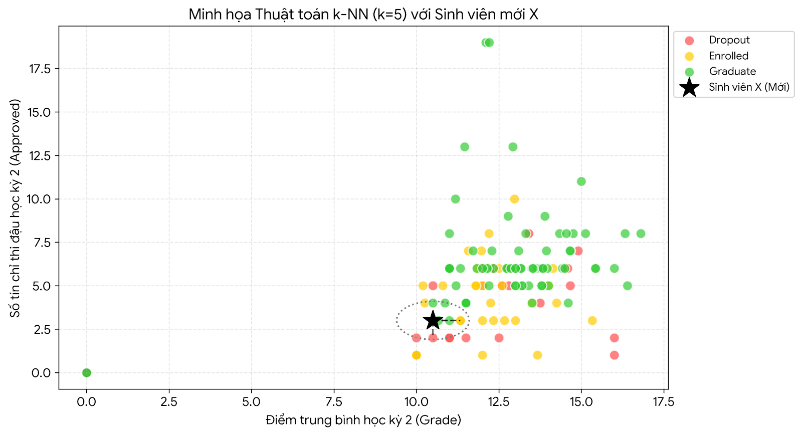

# 🧠 HIỂU NHANH THUẬT TOÁN k-NN (k-Nearest Neighbors)
*Cơ chế: "Ngưu tầm ngưu, mã tầm mã" (Dự đoán dựa trên những người có đặc điểm giống nhất).*

Thay vì cố gắng tìm ra một công thức toán học phức tạp như các thuật toán khác, k-NN chỉ đơn giản là "nhớ" toàn bộ dữ liệu lịch sử của 4.424 sinh viên cũ và dùng nó để so sánh.

Hãy cùng xem cách k-NN đưa ra quyết định cho một sinh viên mới qua 4 bước trực quan sau:

## Hình ảnh minh họa cách k-NN hoạt động trên dữ liệu thực tế
*(Biểu đồ lấy ngẫu nhiên 150 sinh viên từ dữ liệu thực tế để dễ quan sát)*

---

### Bước 1: Biểu diễn sinh viên lên "Bản đồ không gian"
Dữ liệu của dự án có 36 đặc trưng. Để dễ hình dung, chúng ta ép nó xuống một bản đồ 2D với 2 cột quan trọng nhất:
*   **Trục ngang (X):** `Curricular units 2nd sem (grade)` - Điểm trung bình học kỳ 2.
*   **Trục dọc (Y):** `Curricular units 2nd sem (approved)` - Số môn thi đậu học kỳ 2.

Trên bản đồ này, các sinh viên cũ được chấm thành các điểm màu:
*   🔴 **Chấm đỏ (Dropout):** Nằm chủ yếu ở góc dưới cùng bên trái (Điểm thấp, đậu ít môn).
*   🟢 **Chấm xanh (Graduate):** Nằm ở góc trên cùng bên phải (Điểm cao, qua nhiều môn).
*   🟡 **Chấm vàng (Enrolled):** Nằm rải rác ở khoảng giữa.

### Bước 2: Một "tân binh" xuất hiện
Bạn đưa vào hệ thống một **Sinh viên X** mới tinh ở cuối năm nhất. 
Sinh viên X này có: *Điểm trung bình kỳ 2 là 10.5*, và *đậu 3 môn*.
Hệ thống sẽ đặt Sinh viên X lên đúng tọa độ `(10.5, 3)` trên bản đồ (Ngôi sao màu đen). Lúc này, Sinh viên X chưa có nhãn.

### Bước 3: Đo khoảng cách và tìm hàng xóm
Thuật toán vác thước đi đo khoảng cách từ điểm Ngôi sao đen (Sinh viên X) đến **toàn bộ các điểm màu** còn lại trên bản đồ. Nó xem ai có kết quả học tập "gần giống" với Sinh viên X nhất (đo bằng đường chim bay - khoảng cách Euclidean).

Do nhóm cài đặt tham số **`k = 5`**: Thuật toán khoanh một vùng tròn (như trên hình) và lấy ra đúng **5 sinh viên cũ có khoảng cách gần với X nhất**.

### Bước 4: Chốt hạ bằng "Bầu cử" (Voting)
Bây giờ, thuật toán sẽ nhìn vào màu áo của 5 người hàng xóm gần nhất trong vòng tròn nét đứt để quyết định số phận cho Sinh viên X.
*   Giả sử trong vòng tròn có: **4 chấm Đỏ (Dropout)** và **1 chấm Vàng (Enrolled)**.
*   **Kết luận:** Dựa theo nguyên tắc thiểu số phục tùng đa số, k-NN sẽ mạnh dạn gắn nhãn cho Sinh viên X là **Dropout (0)**. 

Logic của thuật toán: *"Vì lịch sử cho thấy những người có điểm số và số tín chỉ đạt y hệt sinh viên X đa số đều đã bỏ học, nên khả năng rất cao sinh viên X cũng sẽ bỏ học."*

---

## ⚠️ Lưu ý sống còn khi nhóm sử dụng k-NN
1.  **Bắt buộc phải chuẩn hóa dữ liệu (Standardization):** Dữ liệu có cột tính bằng điểm (0-20), cột tính bằng tuổi (18-50), hoặc trạng thái học phí (0-1). Nếu không đưa tất cả về cùng một hệ quy chiếu (vd: dùng `StandardScaler`), trục Tuổi lớn hơn sẽ "nuốt chửng" trục Học phí khi đo khoảng cách đường chim bay, dẫn đến dự đoán sai lệch.
2.  **Tốc độ lúc kiểm tra (Test phase) rất chậm:** Khi huấn luyện (Train), k-NN không cần tính toán gì ngoài việc "nhớ" 4.424 sinh viên. Nhưng khi Test, cứ đưa 1 sinh viên mới vào, nó phải lôi cả 4.424 sinh viên ra để trừ và tính căn bậc hai tìm khoảng cách. Do đó, mô hình này tốn nhiều tài nguyên hơn Random Forest khi đưa vào triển khai thực tế.
